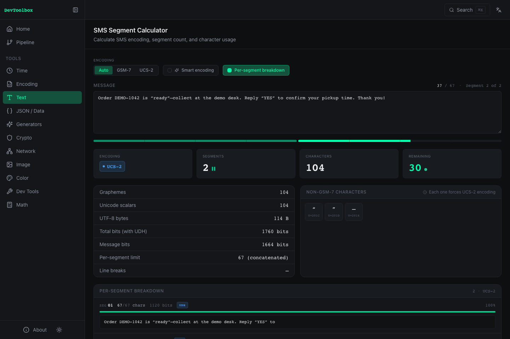
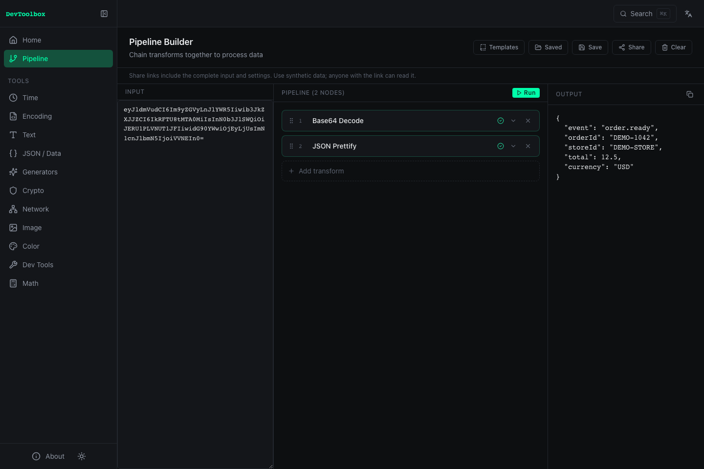

# Dev Toolbox

面向**通信、接口数据和 POS 排障**的浏览器工具箱。定位短信段数变化、解开 Base64 订单事件，或把重复排查流程保存成 Pipeline。

[在线使用](https://app.aiuos.com) · [English](README.md) · [下载 v1.3.0](https://github.com/401040579/dev-toolbox/releases/tag/v1.3.0) · [参与贡献](CONTRIBUTING.md)



## 从三个任务开始

| 任务 | 入口 | 结果 |
| --- | --- | --- |
| 取餐短信突然按更多段计费 | [SMS Segment Calculator](https://app.aiuos.com/tools/text/sms-segment) | GSM-7 / UCS-2 估算、非 GSM 字符高亮、智能编码对比和分段边界 |
| Webhook 或日志字段是 Base64 JSON | [Pipeline](https://app.aiuos.com/pipeline) → 模板 → Base64 → JSON 格式化 | 可读事件数据、可复用步骤和可分享的虚构样例 |
| 虚构订单事件难以核对 | [JSON Formatter](https://app.aiuos.com/tools/json/json-formatter)、Diff、Epoch、Hash | 格式化字段、差异、时间戳和排障记录用的指纹 |

也提供本地二维码生成、Markdown 预览、静态 SVG 清理及编码等小工具。应用无需后端或账号，围绕实际检查任务使用。

## 五分钟上手

1. 打开[短信计算器](https://app.aiuos.com/tools/text/sms-segment)，粘贴这条**虚构**消息：
   ```text
   Order DEMO-1042 is “ready”—collect at the demo desk. Reply “YES” to confirm your pickup time. Thank you!
   ```
   开关「智能编码」，比较编码和段数。弯引号和长破折号会改变编码，规范化后可能减少估算段数。
2. 打开 [Pipeline](https://app.aiuos.com/pipeline)，选择「模板 → Base64 → JSON 格式化」。内置事件使用 `DEMO-1042` 和 `DEMO-STORE`。修改字段、添加转换并检查每一步输出。
3. 试用「模板 → 短信 → 智能编码」，复制结果到短信计算器，检查规范化后的文本。
4. 可以在本地保存 Pipeline，或分享虚构样例。**分享 URL 包含完整输入和配置，持有链接的人均可读取。** 分享样例请勿使用客户、支付、凭据或生产数据。



## 二维码传文件

打开 [二维码传文件](https://app.aiuos.com/tools/image/qr-file-transfer)：A 选择文件并点击“开始发送”，B 切到“接收”后打开摄像头对准 A；接收端校验长度及 SHA-256 后，可预览图片、保存完整文件并继续接收。图片压缩完成后，可直接点击“二维码发送”。支持暂停、1/2/4 码并行、3–30 FPS、预渲染和全屏。可选高速档（V30-L，推荐）、极限档（V40-L，大屏幕）和兼容档（384 字节/M，旧接收端）。高密度档需要两端更新，新接收端仍支持旧 DTF1 帧。

单个文件最多 5 MiB，每批最多 8 个文件、总共 10 MiB；接收端同时保留最多 3 个未完成文件。RaptorQ 的恢复帧处理漏扫和乱序；停止再开启摄像头可续收。发送端只显示播放帧数和轮数，接收端区分有效载荷（含纠错）与完成 SHA-256 校验后的实际文件速度，并显示摄像头处理帧率和解码耗时。双方无需互联，但必须使用本站同一协议；普通相机及 RaptorQR 演示接收页不能代替本站接收页。

文件字节不上传、不写入草稿，仅留在页面内存中。切换模式、离开工具、刷新或清空会丢弃文件，请先保存接收结果。未知格式、HTML、SVG 和视频只提供下载；图片预览仅支持 PNG/JPEG/WebP/GIF/AVIF/BMP。文件名移除路径/控制字符并最多保留 255 个 UTF-8 字节。首次联网加载并完成 PWA 缓存后可断网重开，页面确认扫码引擎已缓存才显示“已可离线使用”。摄像头需 HTTPS 或 localhost，且必须由用户点击启动。

真实屏幕像素→模拟摄像头视频→扫码 Worker→文件下载的 Chromium 流程已自动验证，包括断网、漏帧、续收及字节一致性；手机真机速度与电脑/iPhone/Android 跨设备验收尚未完成，未承诺硬件传输速率。极限档在模拟视频流中约 3.9 秒传完 1 MiB 随机文件（约 263 KiB/s），超过旧 2.25 KiB/s 配置的百倍，但不代表真机保证。详见 [v1.3 验证记录](docs/releases/v1.3.0-validation.md)。

## v1.1 工作流程

- **草稿恢复**：现有工具和新增工具的文本输入、模式及选项自动保存在当前浏览器，切换工具和刷新后恢复；工具顶部可关闭恢复、清空当前或清空全部。原始文件句柄、生成的凭据和密码/密钥输入框不保存；导入后成为文本的日志和 Data URL 按文本输入处理。草稿单个工具最多 524,288 个 JSON 字符（含选项）；超限或保存失败会明确显示“仅本次会话”，不影响处理。Pipeline 继续使用已有的主动保存。
- **[JSON 结构对比](https://app.aiuos.com/tools/json/json-diff)**：按字段查看新增、删除和修改，忽略对象键顺序，保留类型、数组顺序及不存在/null 的差异；复制或下载完整 JSON 报告。每侧 1 MiB、20,000 个值、64 层、最多 500 项差异；不能完整保留的数值明确拒绝，精确大数和高精度小数请用字符串。筛选仅影响显示，重复键遵循 JSON.parse 最后值规则。
- **[日志分析器](https://app.aiuos.com/tools/devtools/log-analyzer)**：粘贴或拖入 .log/.txt/.jsonl，按时间、级别、关键词及精确请求 ID 筛选，点击请求 ID 查看完整过程。使用 Worker，输入上限 10 MiB，每页 100 条，预览每条最多 4,000 字符；复制和导出保留完整原文。超过 100,000 条索引时，剩余原文作为未识别块保留并提示；未识别行不会丢弃。
- **智能粘贴**：点击顶部“智能粘贴”，识别 JSON、JWT、秒/毫秒时间戳、HTTP(S) URL、可读文本 Base64 或普通文本；选择候选后带入相应工具。输入上限 1 MiB，仅主动点击才读取剪贴板；内容通过标签页内存传递，目标工具按草稿设置保存，URL 不包含输入。

## 本地运行

使用 **Node.js 22** 和 npm 10 或更新版本。依赖锁文件已提交。

```bash
git clone https://github.com/401040579/dev-toolbox.git
cd dev-toolbox
# 使用 nvm 时：nvm use
npm ci
npm run dev
```

打开 Vite 输出的地址。构建生产版本：

```bash
npm run build
npm run preview
```

[正式版本](https://github.com/401040579/dev-toolbox/releases/tag/v1.3.0)提供静态站点 ZIP、SHA-256 校验文件和 GitHub 源码归档。解压站点 ZIP，执行 `python3 serve.py`，打开 `http://localhost:4173`。请使用本地 HTTP 服务，直接打开 `index.html` 文件不能满足模块加载和 Web Crypto 的运行条件。在干净的版本 tag 上重建制品：`npm ci`、`npm run build`、`npm run release:package`（需要 Python 3）。

## 隐私、离线和功能边界

- **工具输入在浏览器处理，不上传。** 二维码预览与 SVG 下载在本地生成；托管服务仍会收到普通站点请求。应用不接入分析服务或追踪 Cookie。
- 偏好、收藏、开启恢复的工具草稿和主动保存的 Pipeline 使用浏览器本地存储。分享配置写在 URL 片段中，普通 HTTP 请求不会发送该片段，但接收者可读取，浏览器历史也可能保留。外部链接仅在主动点击时打开，并离开应用。
- Markdown 支持常见 GFM 结构，包括列表、表格、代码和链接。原始 HTML 按文本展示，图片按替代文本展示，防止自动请求资源。
- SVG 清理仅支持**静态图形**。预览与导出均移除脚本、事件属性、CSS、动画、嵌入图片及外部引用；支持本地渐变、蒙版、裁剪和片段引用。这是轻量清理工具，不能替代完整 SVGO。
- 生产应用成功在线加载后由 Service Worker 预缓存。首次访问和更新需要联网；存储回收或隐私浏览可能影响离线可用性。新版本会提示重新加载，请先复制未保存输入。较旧缓存版本没有更新提示时，请关闭本站所有标签页和已安装应用窗口，再联网重新打开。
- 短信结果是估算，不能保证与运营商账单一致；供应商编码、拼接头和计费规则可能不同。「Password Hash」采用 PBKDF2-SHA256，并非 bcrypt；JWT/OAuth 解码不验证令牌真实性，「未过期」仅描述时间字段；MD5、CRC 用于旧系统兼容与校验。
- JSON/YAML 转换使用 YAML 1.2 核心类型。TOML 要求根节点为对象，不支持 null；未加引号的日期/时间会被拒绝，保留文本请加引号。两个转换器均明确拒绝不支持的类型、非有限数及超过 JavaScript 安全范围的整数，避免静默改写。限制：输入 1 MiB、输出 4 MiB、64 层、50,000 个值、100 次 YAML 别名展开。
- Cron 工具支持五个数字字段及列表、范围、步长，星期日可用 `0`/`7`；明确拒绝名称字段和方言扩展。未来执行时间按浏览器本地时区计算，最多查找 366 天，不模拟特定服务器的夏令时处理规则。
- 分享配置最多支持 32 步、250,000 个 JSON 字符和 8,000 个 URL 字符，超限时显示提示。自动浏览器验证针对 Chromium；Firefox、Safari 和移动端 PWA 安装尚未独立认证。

## 验证与贡献

```bash
npm run lint
npm run typecheck
npm test
npm run build
npx playwright install chromium
npm run test:e2e
npm audit
```

CI 完成干净安装、lint、单测、依赖审计、生产构建与 Chromium E2E 后，按现有 GitHub Pages 流程部署 `main`，继续使用 `app.aiuos.com`。构建版本可在 [`version.json`](https://app.aiuos.com/version.json) 核对。参见[贡献指南](CONTRIBUTING.md)、[安全报告](SECURITY.md)、[版本说明](CHANGELOG.md)与[发布验证记录](docs/releases/v1.1.0-validation.md)。

## 许可与来源

自有代码采用 [MIT](LICENSE)。Twilio 的短信字符表、智能编码映射及分段方法保留 Twilio MIT 归属。Lucide、DOMPurify、Marked、node-qrcode 等依赖保留各自许可证。[第三方归属](THIRD_PARTY_NOTICES.md)列出来源版本及完整声明，静态制品也包含这些声明。截图仅含虚构数据，未使用 Twilio 标志或客户记录。
